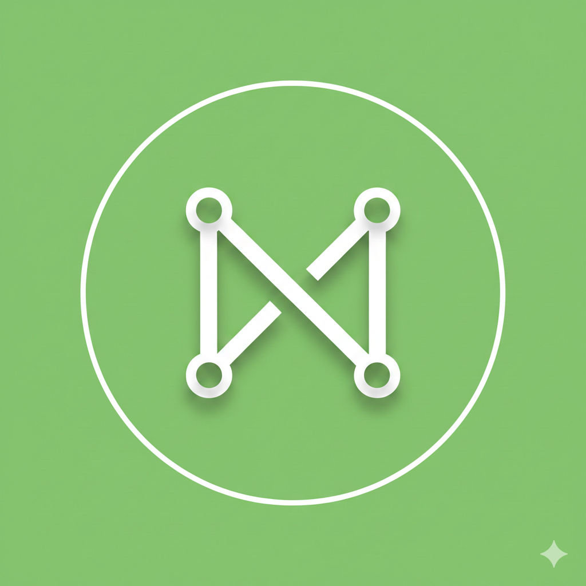

<h1>N E X U S</h1>

  <strong>A Fullstack Social Website, that mixes X & Discord.</strong>

  <a href="#architecture">Architecture</a> •
  <a href="#status">Status</a> •
  <a href="#tech-stack">Tech Stack</a>

---

## Project Purpose

Nexus is a technical **Proof-of-Concept (PoC)** designed to demonstrate proficiency in TypeScript-driven fullstack development. The primary focus of this project is not just "another social clone," but an exercise in building a **robust, scalable architecture** from scratch.

### Separation of Concerns

Unlike many modern Next.js projects that rely solely on Server Actions, Nexus follows the principle of **Security through Server/Client Separation**:

* **Decoupled Backend:** A dedicated **Nest.js API** handles business logic, security, and database interactions.
* **Independent Frontend:** **Next.js** acts purely as a consumer of the API, ensuring that the backend remains platform-agnostic and easier to scale or secure independently.
* **Data Sovereignty:** All content moderation (Text & Image scanning) is handled locally on the server to avoid reliance on external 3rd-party APIs.

---

## Development Status

### Implemented
* Nothing, i just started.

### 🛠️ Planned (In Development)
* **User Accounts:** Secure registration logic and JWT-based authentication.
* **Database Foundation:** Scalable SQL schema using Prisma.
* **Profile Management:** Custom bios, avatars, and account settings.
* **Global Feed:** A Twitter-style timeline with Posts and Comments.
* **Chatrooms:** A Discord-style Group chats with Realtime Chatting via WebSockets.
* **Messaging:** 1:1 Realtime DMs via WebSockets.
* **Local AI Moderation:** Integrate a Filter for local image & text scanning and custom profanity filters.
* **Admin Tools:** Dedicated moderation page for banning users and updating filters.

---

## 🛠️ Tech Stack

**Backend:**  
 

**Frontend:**  
 

 
Built with ☕ and TypeScript by Lucy

